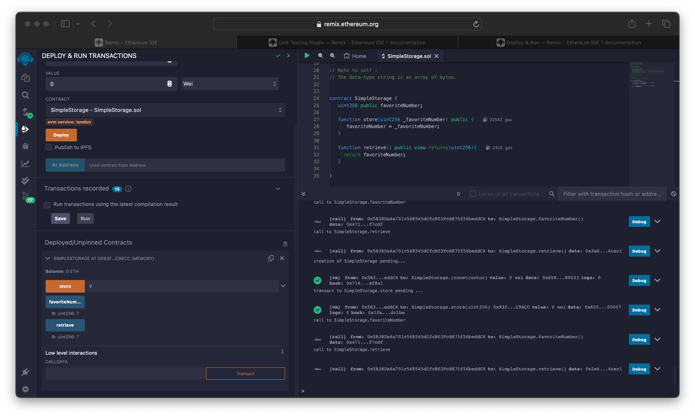
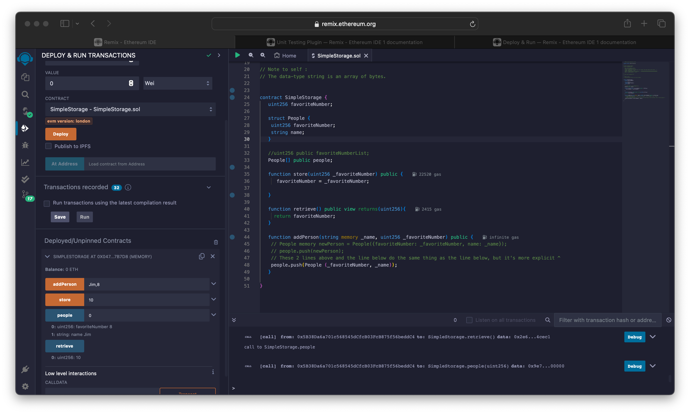
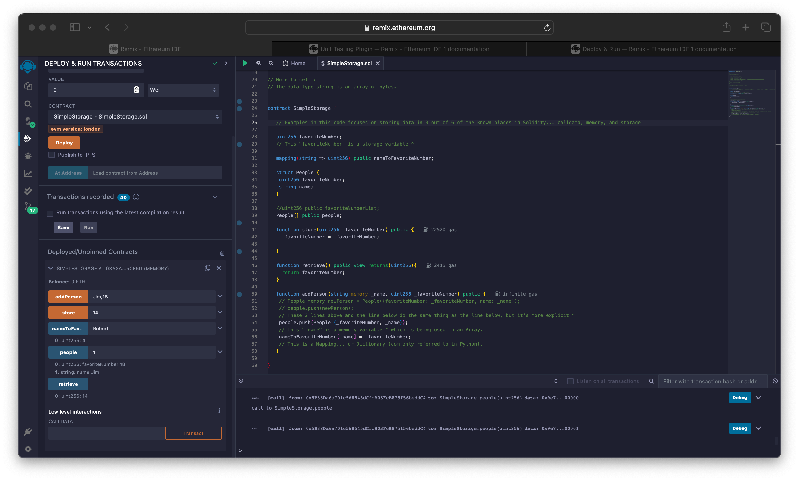

These are my notes while working on this Solidity course section.

- On April 2, 2024 successfully compiled and deployed the following "store-retrieve" example code.

- On April 2, 2024 successfully compiled and deployed the following "Struct and Arrays" example code.

- On April 2, 2024 successfully compiled and deployed the following "Mapping" example code.

- On April 2, 2024 successfully compiled and deployed the current version of the example code to Sepolia Testnet.

https://sepolia.etherscan.io/address/0x751449a4e86c013cde50d93d89e5323664ad03cc
